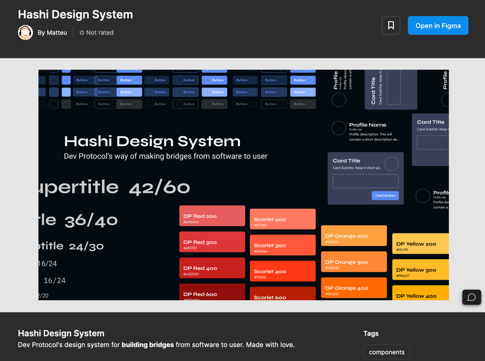

To get you started quickly with designing, we're going to provide you with the official [Hashi UI Design Kit](https://www.figma.com/community/file/1289131280114725916/hashi-design-system).

The UI Kit contains all the tokens, all the presets, and all the primitive components you need to start building a project for the Dev Protocol Ecosystem.

## Guidelines on using the UI Kit

1. Be sure to always work on the screen size of the device you're planning to design on. This ensures that every component you design is responsive and is true to size with the library.
2. Be sure to always use the latest version of the UI Kit. We're constantly updating the UI Kit to ensure that it's always up-to-date with the latest changes in the design system.
3. Since the design system implementation uses tokens, use the primitive tokens when you can. This ensures that every design specified in the Figma file can be easily replicated with the code. This also ensures that the design is consistent across other product design files.
4. Use the components whenever possible. The components should serve as building blocks for other components. Whenever you feel the need to create a new component, be sure to document it in the design system.
5. Use the design system as a guide, not as a rule. The design system is a tool to help you design faster, and more efficiently. It's not a rule book that you have to follow to the letter. If you feel like you need to break the rules to achieve a better design, then do so. Just be sure to document it in the design system.