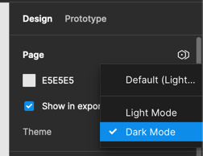
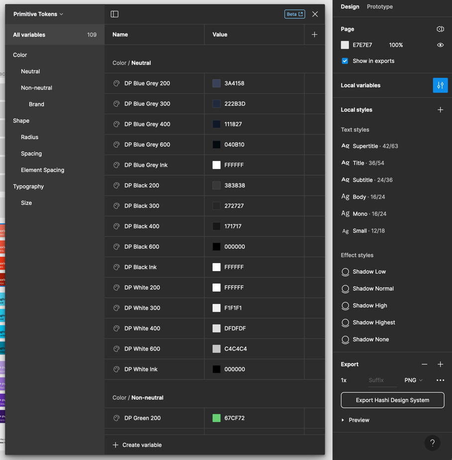
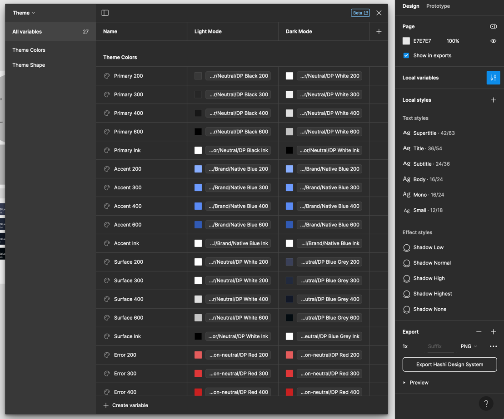
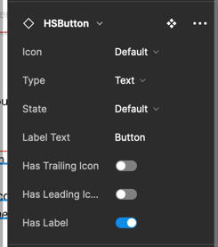
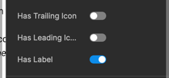
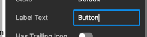
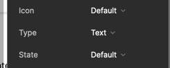

The sidebar in figma is a versatile tool that allows you to quickly navigate through the design file. It also allows you to quickly modify component props, use component variants and states, as well as toggle in between Hashi's default themes.

## Theming
Hashi uses color schemes to provide user control over which theme they want the application to render in. The color
scheme of the design file can be defined/modified in the 'Design' panel of the Figma file.

Hashi provides you with two main color themes, light and dark. The light theme is the default theme, and the dark theme
is the alternative theme.

### Primitive Tokens
Primitive tokens are the smallest units of design in Hashi. These tokens are used to define the color, shape, and typography. These are accessed through the 'Local variables' panel of the Figma file and selecting 'Primitive Tokens' from the collections dropdown.

### Theme Tokens
Theme tokens are the building blocks of the color themes. These tokens are used to define the color, shape, and typography of the themes. These are accessed through the 'Local variables' panel of the Figma file and selecting 'Theme' from the collections dropdown.

## Component props
You can modify component props using the 'Design' panel of the Figma file.

### Boolean props
Boolean props can only have two states--on or off. You can toggle these to trigger sub-component visibility, and/or states. These props are usually prefixed with the words 'Is' or 'Has'.

### String props
String props are for text-based values that go into components and subcomponents (like labels, and helper texts).

### Dropdown props
Dropdown props provide designers with a limited set of variants they want to set the component in. These usually contain component states (like hover, active, focus, and disabled), variant styles, and component structure variant styles. These are the most versatile props in the design system.

