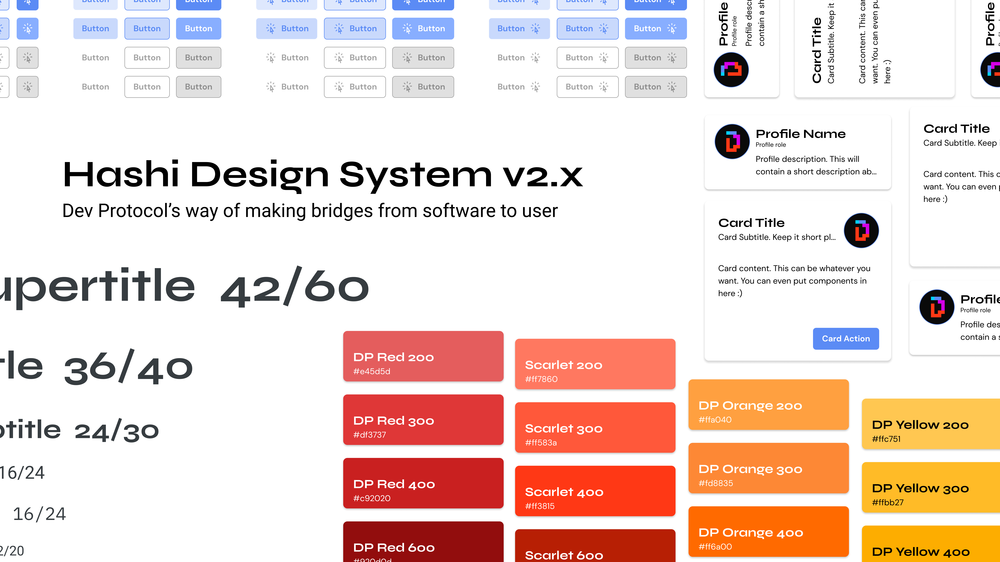

Hashi is Dev Protocol's design system. Aiming to bring a unified user experience when using Dev Protocol products, to present an elegant user interface for consumers to interact with, and to be able to create the same user interfaces regardless of any frontend framework.

Hashi has documented all of its design guidelines to help UI designers design their ideal product in accordance to the design system.

## Foundations
<a href="#" class="text-scarlet-400 weight-bold line-height-subtitle">Color</a>

Learn about Hashi's use of colors, how to use the color system to design beautiful, accessible, and consistent interfaces.

<a href="#" class="text-scarlet-400 weight-bold line-height-subtitle">Shape</a>

Learn about Hashi's way of creating shapes in user interfaces.

<a href="#" class="text-scarlet-400 weight-bold line-height-subtitle">Typography</a>

Learn how to work with Hashi's typefaces to design readable written content.

<a href="#" class="text-scarlet-400 weight-bold line-height-subtitle">Layout</a>

Create flexible and expressive layouts using Hashi's layout guidelines.
