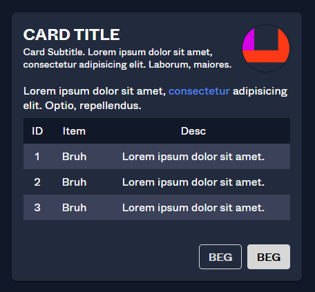

# Cards
Cards are a blank surface component that serves short-form/summarized content to the user.



## Usage
### HTML
```html
<div class="hs-card">
    <header class="hs-card__header">
        <div class="hs-card__mast">
            <h2 class="hs-card__title">CARD TITLE</h2>
            <p class="hs-card__subtitle">Card Subtitle.</p>
        </div>
    </header>
    <main class="hs-card__content">
        Card content :)
    </main>
</div>
```

### SCSS/CSS
```scss
@use 'node_modules/@devprotocol/hashi';
@use 'node_modules/@devprotocol/hashi/hs-card';

@include hashi.init {
  @include hs-card.render();
}
```

### Card Actions
Card actions is the most bottom section of a card. It contains buttons/hyperlinks that redirect the user to another page, submit an in-card form, or perform any action on click.
```html
<div class="hs-card">
    <header class="hs-card__header">
        <div class="hs-card__mast">
            <h2 class="hs-card__title">CARD TITLE</h2>
            <p class="hs-card__subtitle">Card Subtitle.</p>
        </div>
    </header>
    <main class="hs-card__content">
        Card content :)
    </main>
    <footer class="hs-card__footer">
        <button class="hs-button is-filled" role="button">
            <span class="hs-button__label">Button</span>
        </button>
        <button class="hs-button" role="button">
            <span class="hs-button__label">Button</span>
        </button>
    </footer>
</div>
```

### Card Icons
Card icons provide a way of associating a certain symbol to a card. This is especially useful for token images. The card icon element can only take either an SVG or an image.
```html
<div class="hs-card">
    <header class="hs-card__header">
        <div class="hs-card__mast">
            <h2 class="hs-card__title">CARD TITLE</h2>
            <p class="hs-card__subtitle">Card Subtitle.</p>
        </div>
        <div class="hs-card__icon">
            <!-- Img or SVG -->
        </div>
    </header>
    <main class="hs-card__content">
        Card content :)
    </main>
</div>
```

### Card Media
Card media allows you to have an image that comes along with your card.
```html
<div class="hs-card">
    <section class="hs-card__media">
        
    </section>
    <header class="hs-card__header">
        <div class="hs-card__mast">
            <h2 class="hs-card__title">CARD TITLE</h2>
            <p class="hs-card__subtitle">Card Subtitle.</p>
        </div>
    </header>
    <main class="hs-card__content">
        Card content :)
    </main>
</div>
```

## API
### CSS Classes
These are used to structure, extend, and modify the styles of a component on the markup.

| Class                | Effect                                              |
|----------------------|-----------------------------------------------------|
| `.hs-card`           | Main card class.                                    |
| `.hs-card__header`   | The header section of the card component.           |
| `.hs-card__mast`     | The identification section of the card.             |
| `.hs-card__title`    | The title of the card.                              |
| `.hs-card__subtitle` | The subtitle of the card.                           |
| `.hs-card__icon`     | The icon of the card.                               |
| `.hs-card__media`    | The media of the card.                              |
| `.hs-card__content`  | The content section of the card.                    |
| `.hs-card__actions`  | Here is where you put all the buttons for the card. |

### Custom Properties
These are for creating your own component themes.

| Property                  | Effect                               |
|---------------------------|--------------------------------------|
| `--hs-card-fill`          | Changes the card's background color. |
| `--hs-card-ink`           | Changes the card's text color.       |
| `--hs-card-border`        | Changes the card's border color.     |
| `--hs-card-radius`        | Changes the card's border radius.    |
| `--hs-card-padding`       | Changes the card's padding.          |
| `--hs-card-weight`        | Changes the card's border color.     |
| `--hs-card-ink`           | Changes the card's content color.    |
| `--hs-card-size`          | Changes the card's content size.     |
| `--hs-card-title-size`    | Changes the card's title size.       |
| `--hs-card-subtitle-size` | Changes the card's subtitle size.    |

#### Example
```scss
.my-card-theme {
  --hs-card-fill: #232323;
  --hs-card-ink: lime;
  --hs-card-border: var(--hs-button-fill);
  
  &:hover {
    --hs-card-fill: #353535;
  }
  
  &:active {
    --hs-card-fill: #535353;
  }
}
```
### Configuring styles
Here are all the themeable properties for this component. The directions to use these properties are located in
the [render API](index.md#modification-scss).

```scss
$fill: 'surface' !default;
$ink: 'surface-ink' !default;
$border: 'primary' !default;
$tone: 400 !default;

$radius: 'medium' !default;
$padding: 'md' !default;

$family: 'body' !default;
$size: 'body' !default;
$weight: 'normal' !default;
$line-height: 'normal' !default;
```

### Extending styles
If you wish to extend the component styles, the [`extend()` API](index.md#extension-scss) might come in handy.