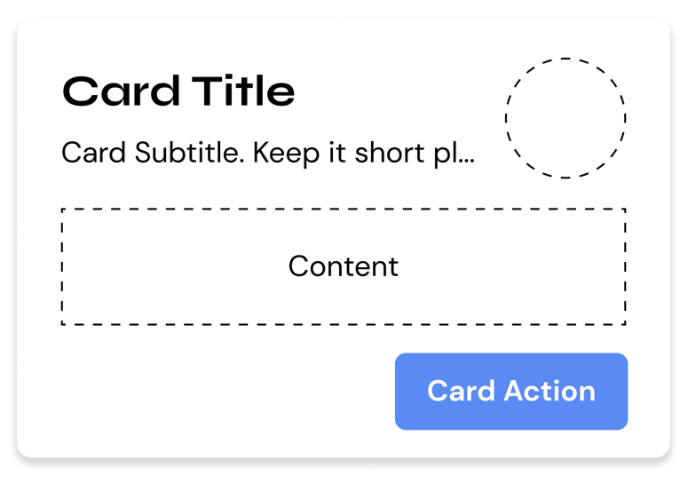

Cards are a blank surface component that serves short-form/summarized content to the user.



## Usage
### HTML
```html
<div class="hs-card">
    <header class="hs-card__header">
        <div class="hs-card__mast">
            <h2 class="hs-card__title">CARD TITLE</h2>
            <p class="hs-card__subtitle">Card Subtitle.</p>
        </div>
    </header>
    <main class="hs-card__content">
        Card content :)
    </main>
</div>
```

### SCSS/CSS
```scss
@use 'node_modules/@devprotocol/hashi';
@use 'node_modules/@devprotocol/hashi/hs-card';

@include hashi.init {
  @include hs-card.render();
}
```

### Outlined Card
The outlined card style is the default card style.
```html
<div class="hs-card">
    <header class="hs-card__header">
        <div class="hs-card__mast">
            <h2 class="hs-card__title">CARD TITLE</h2>
            <p class="hs-card__subtitle">Card Subtitle.</p>
        </div>
    </header>
    <main class="hs-card__content">
        Card content :)
    </main>
</div>
```

### Filled Card
The filled card style is a style variant of the card component. To enable this style, attach the `.is-filled` class to the parent element's class list.

> The class names inside brackets are only for emphasis, not to be used in the actual implementation.

```html
<div class="hs-card [is-filled]">
    <header class="hs-card__header">
        <div class="hs-card__mast">
            <h2 class="hs-card__title">CARD TITLE</h2>
            <p class="hs-card__subtitle">Card Subtitle.</p>
        </div>
    </header>
    <main class="hs-card__content">
        Card content :)
    </main>
</div>
```

### Card Actions
Card actions is the most bottom section of a card. It contains buttons/hyperlinks that redirect the user to another page, submit an in-card form, or perform any action on click.
```html
<div class="hs-card">
    <header class="hs-card__header">
        <div class="hs-card__mast">
            <h2 class="hs-card__title">CARD TITLE</h2>
            <p class="hs-card__subtitle">Card Subtitle.</p>
        </div>
    </header>
    <main class="hs-card__content">
        Card content :)
    </main>
    <footer class="hs-card__footer">
        <button class="hs-button is-filled" role="button">
            <span class="hs-button__label">Button</span>
        </button>
        <button class="hs-button" role="button">
            <span class="hs-button__label">Button</span>
        </button>
    </footer>
</div>
```

### Card Icons
Card icons provide a way of associating a certain symbol to a card. This is especially useful for token images. The card icon element can only take either an SVG or an image.
```html
<div class="hs-card">
    <header class="hs-card__header">
        <div class="hs-card__mast">
            <h2 class="hs-card__title">CARD TITLE</h2>
            <p class="hs-card__subtitle">Card Subtitle.</p>
        </div>
        <div class="hs-card__icon">
            <!-- Img or SVG -->
        </div>
    </header>
    <main class="hs-card__content">
        Card content :)
    </main>
</div>
```

### Card Media
Card media allows you to have an image that comes along with your card.
```html
<div class="hs-card">
    <section class="hs-card__media">
        
    </section>
    <header class="hs-card__header">
        <div class="hs-card__mast">
            <h2 class="hs-card__title">CARD TITLE</h2>
            <p class="hs-card__subtitle">Card Subtitle.</p>
        </div>
    </header>
    <main class="hs-card__content">
        Card content :)
    </main>
</div>
```

## API
### CSS Classes
These are used to structure, extend, and modify the styles of a component on the markup.

### Anatomical Classes
These classes make up the elements inside a component.

| Class                | Effect                                              |
|----------------------|-----------------------------------------------------|
| `.hs-card`           | Main card class.                                    |
| `.hs-card__header`   | The header section of the card component.           |
| `.hs-card__mast`     | The identification section of the card.             |
| `.hs-card__title`    | The title of the card.                              |
| `.hs-card__subtitle` | The subtitle of the card.                           |
| `.hs-card__icon`     | The icon of the card.                               |
| `.hs-card__media`    | The media of the card.                              |
| `.hs-card__content`  | The content section of the card.                    |
| `.hs-card__actions`  | Here is where you put all the buttons for the card. |

### Variant Classes
For information on how to use these classes, [click here](index.md#modification-html).

| Class        | Effect                                |
|--------------|---------------------------------------|
| `.is-raised` | Renders the card in its raised style. |

### Custom Properties
These are for creating your own component theme classes that you can append to the parent element markup.

| Property                         | Effect                                   |
|----------------------------------|------------------------------------------|
| `--hs-card-fill`                 | Changes the card's background color.     |
| `--hs-card-ink`                  | Changes the card's text color.           |
| `--hs-card-border`               | Changes the card's border color.         |
| `--hs-card-radius`               | Changes the card's border radius.        |
| `--hs-card-padding`              | Changes the card's padding.              |
| `--hs-card-section-gap`          | Changes the card's section's gaps.       |
| `--hs-card-header-gap`           | Changes the card's header gap.           |
| `--hs-card-footer-gap`           | Changes the card's footer gap.           |
| `--hs-card-weight`               | Changes the card's border color.         |
| `--hs-card-ink`                  | Changes the card's content color.        |
| `--hs-card-family`               | Changes the card content's family.       |
| `--hs-card-size`                 | Changes the card content's size.         |
| `--hs-card-weight`               | Changes the card content's weight.       |
| `--hs-card-line-height`          | Changes the card content's line-height.  |
| `--hs-card-title-family`         | Changes the card title's family.         |
| `--hs-card-title-size`           | Changes the card title's size.           |
| `--hs-card-title-weight`         | Changes the card title's weight.         |
| `--hs-card-title-line-height`    | Changes the card title's line-height.    |
| `--hs-card-subtitle-family`      | Changes the card subtitle's family.      |
| `--hs-card-subtitle-size`        | Changes the card subtitle's size.        |
| `--hs-card-subtitle-weight`      | Changes the card subtitle's weight.      |
| `--hs-card-subtitle-line-height` | Changes the card subtitle's line-height. |
| `--hs-card-icon-size`            | Changes the card's icon size.            |
| `--hs-card-media-height`         | Changes the card's media height.         |

#### Example
```scss
.my-card-theme {
  --hs-card-fill: #232323;
  --hs-card-ink: lime;
  --hs-card-border: var(--hs-button-fill);
  
  &:hover {
    --hs-card-fill: #353535;
  }
  
  &:active {
    --hs-card-fill: #535353;
  }
}
```
### Configuring styles
Here are all the themeable properties for this component. The directions to use these properties are located in
the [render API](index.md#modification-scss).

```scss
$fill: 'surface-200' !default;
$ink: 'surface-ink' !default;
$border: 'primary-400' !default;
$tone: 200 !default;

$radius: 'medium' !default;
$padding: 'md' !default;

$title-typography: 'subtitle' !default;
$subtitle-typography: 'body' !default;
$content-typography: 'body' !default;

$icon-size: 66px !default;
$media-height: 120px !default;

$section-gap: 'md' !default;
$header-gap: 'md' !default;
$footer-gap: 'sm' !default;
```

### Extending styles
If you wish to extend the component styles, the [`extend()` API](index.md#extension-scss) might come in handy.