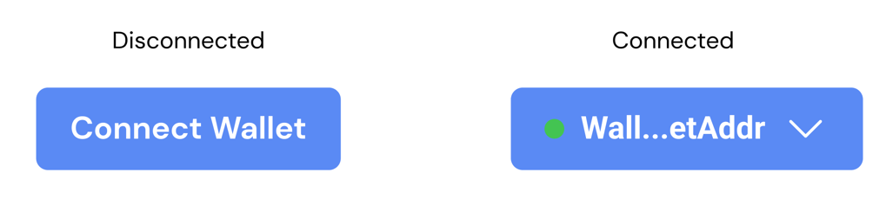

The wallet component allows users to connect their wallets to a Dev Protocol app.



## Usage
### HTML
```html
<div class="hs-wallet">
    <a class="hs-button is-wallet-button">
        <i class="hs-button__icon"></i>
        <span class="hs-button__label">Connect Wallet</span>
    </a>
    <ul class="hs-wallet__details">
        <li>Network: ???</li>
    </ul>
</div>
```

### SCSS/CSS
```scss
@use 'node_modules/@devprotocol/hashi';
@use 'node_modules/@devprotocol/hashi/hs-wallet';

@include hashi.init {
  @include hs-wallet.render();
}
```

## Connected Wallet
Whenever a wallet gets connected, append the `.is-connected` class to the parent element's class list. This will trigger special styling for the wallet details and the button icon.
```html
<div class="hs-wallet is-connected">
    <a class="hs-button is-wallet-button">
        <i class="hs-button__icon"></i>
        <span class="hs-button__label">[Address Here]</span>
    </a>
    <ul class="hs-wallet__details">
        <li>Network: Polygon</li>
    </ul>
</div>
```

## API
### CSS Classes
These are used to structure, extend, and modify the styles of a component on the markup.

### Anatomical Classes
These classes make up the elements inside a component.

| Class                 | Effect                    |
|-----------------------|---------------------------|
| `.hs-wallet`          | Main/parent wallet class. |
| `.hs-wallet__details` | The wallet details.       |

### Variant Classes
For information on how to use these classes, [click here](index.md#modification-html).

| Class               | Effect                                      |
|---------------------|---------------------------------------------|
| `.is-connected`     | Renders styling if the wallet is connected. |
| `.is-wallet-button` | Indicates the wallet button.                |

We also include variant classes for the `hs-wallet__details` subcomponent. These are mainly for positioning where the details render.

| Class       | Effect                                         |
|-------------|------------------------------------------------|
| `.is-left`  | Renders the subcomponent aligned to the left   |
| `.is-right` | Renders the subcomponent aligned to the right. |

### Custom Properties
These are for creating your own component theme classes that you can append to the parent element markup.

| Property                          | Effect                                        |
|-----------------------------------|-----------------------------------------------|
| `--hs-wallet-details-fill`        | Changes the wallet detail's background color. |
| `--hs-wallet-details-ink`         | Changes the wallet detail's text color.       |
| `--hs-wallet-details-border`      | Changes the wallet detail's border color.     |
| `--hs-wallet-details-radius`      | Changes the wallet detail's border radius.    |
| `--hs-wallet-details-padding`     | Changes the wallet detail's padding.          |
| `--hs-wallet-details-shadow`      | Changes the wallet detail's shadow.           |
| `--hs-wallet-details-family`      | Changes the wallet detail's font family.      |
| `--hs-wallet-details-size`        | Changes the wallet detail's font size.        |
| `--hs-wallet-details-weight`      | Changes the wallet detail's font weight.      |
| `--hs-wallet-details-line-height` | Changes the wallet detail's line height.      |

#### Example
```scss
.my-select-field-theme {
  --hs-wallet-details-fill: #232323;
  --hs-wallet-details-ink: lime;
  --hs-wallet-details-border: var(--hs-wallet-details-fill);
}
```
### Configuring styles
Here are all the themeable properties for this component. The directions to use these properties are located in
the [render API](index.md#modification-scss).

```scss
$fill: 'primary-400' !default;
$fill-hover: 'primary-400' !default;
$fill-focus: 'primary-400' !default;
$fill-active: 'primary-200' !default;
$fill-disabled: 'disabled' !default;

$ink: 'primary-ink' !default;
$ink-disabled: 'disabled-ink' !default;

$border: $fill !default;
$border-hover: $fill-hover !default;
$border-focus: $fill-focus !default;
$border-active: $fill-active !default;
$border-disabled: $fill-disabled !default;

$radius: 'small' !default;
$padding: ('xs' 'md') !default;
```

### Extending styles
If you wish to extend the component styles, the [`extend()` API](index.md#extension-scss) might come in handy.