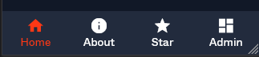

# HSAppbar Component


## Usage
### HTML
```html
<nav class="hs-appbar">
    <ul class="hs-appbar__wrap">
        <li class="hs-appbar__item active">
            <a href="#">
                <i class="hs-appbar__item__icon material-icons" aria-hidden="true">home</i>
                <span class="hs-appbar__item__label" aria-hidden="false">Home</span>
            </a>
        </li>
        <li class="hs-appbar__item">
            <a href="#">
                <i class="hs-appbar__item__icon material-icons" aria-hidden="true">info</i>
                <span class="hs-appbar__item__label" aria-hidden="false">About</span>
            </a>
        </li>
        <li class="hs-appbar__item">
            <a href="#">
                <i class="hs-appbar__item__icon material-icons" aria-hidden="true">star</i>
                <span class="hs-appbar__item__label" aria-hidden="false">Star</span>
            </a>
        </li>
        <li class="hs-appbar__item">
            <a href="#">
                <i class="hs-appbar__item__icon material-icons" aria-hidden="true">dashboard</i>
                <span class="hs-appbar__item__label" aria-hidden="false">Admin</span>
            </a>
        </li>
    </ul>
</nav>
```

### SCSS/CSS

```scss
@use 'path/to/@devprotocol/hashi/hs-appbar';

@include hs-appbar.render();
```

## API

### CSS Classes

These are used to extend and modify the styles of a component on the markup.

| Class                     | Effect                             |
|---------------------------|------------------------------------|
| `.hs-appbar`              | Main appbar class.                 |
| `.hs-appbar__wrap`        | Wrapper for the appbar.            |
| `.hs-appbar__item`        | Appbar item class.                 |
| `.hs-appbar__item__icon`  | Class for the appbar item's icon.  |
| `.hs-appbar__item__label` | Class for the appbar item's label. |

### Custom Properties

These are for creating your own component themes.

| Property                      | Effect                                 |
|-------------------------------|----------------------------------------|
| `--hs-appbar-fill`            | Changes the appbar's background color. |
| `--hs-appbar-ink`             | Changes the appbar's text color.       |
| `--hs-appbar-border`          | Changes the appbar's border color.     |
| `--hs-appbar-item-ink`        | Changes the appbar item's ink color.   |
| `--hs-appbar-item-icon-size`  | Changes the appbar item's icon size.   |
| `--hs-appbar-item-label-size` | Changes the appbar item's label size.  |

#### Example

```scss
.my-appbar-theme {
    --hs-appbar-fill: #232323;
    --hs-appbar-ink: lime;
    --hs-appbar-border: var(--hs-button-fill);
}
```

### SCSS `render()` mixin

| Property    | Type  | Effect                                                                     |
|-------------|-------|----------------------------------------------------------------------------|
| `$color`    | `map` | Configures what and how to render the color styles for the component.      |
| `$settings` | `map` | Additional style and rendering configurations.                             |

#### `$color` parameter

| Property  | Type     | Effect                                      |
|-----------|----------|---------------------------------------------|
| `default` | `token`  | Defines what the default color to use.      |
| `active`  | `token`  | Defines what the active state color to use. |

#### `$settings` parameter

| Property        | Type      | Effect                                                         |
|-----------------|-----------|----------------------------------------------------------------|
| `items`         | `integer` | Sets the number of items to place in the appbar.               |
| `breakpoint`    | `token`   | Sets the default breakpoint.                                   |
| `has-elevation` | `boolean` | Determines if the component will render with elevation or not. |